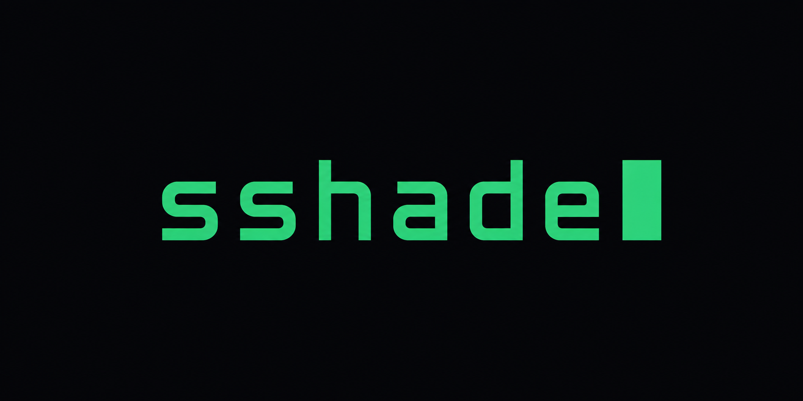
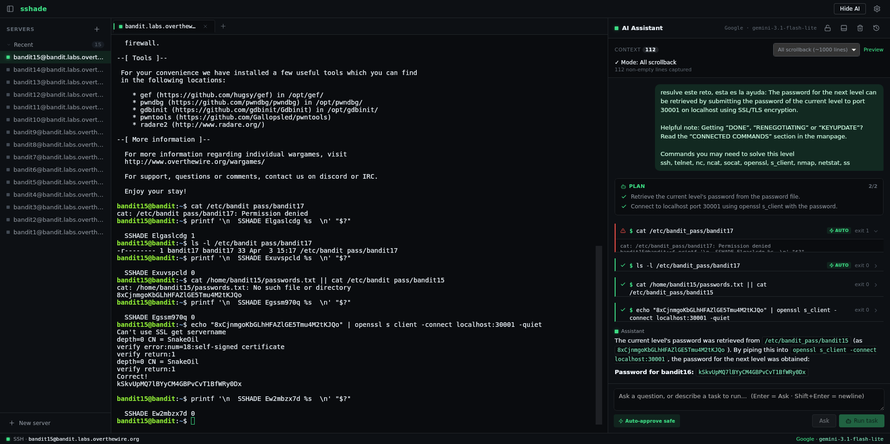
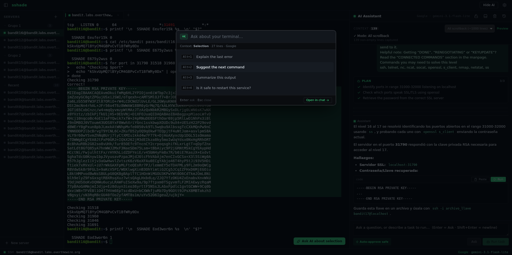
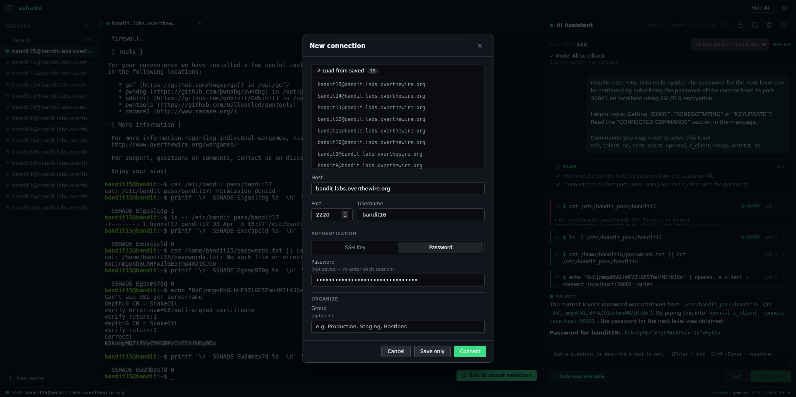
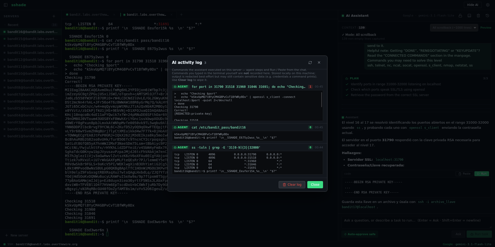
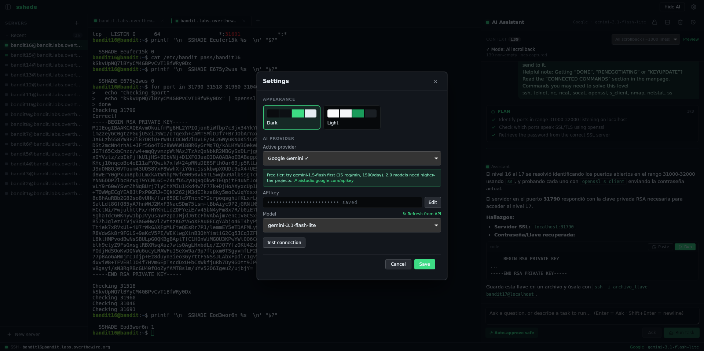

<div align="center">



**SSH terminal with an AI assistant that actually sees your session.**

No more copy-pasting logs into a chat tab. Connect to your servers, ask the
AI about what's on screen, or hand it a task and watch it work — step by
step, with your approval.

`Tauri 2` · `Rust` · `React` · `xterm.js` — Windows · macOS · Linux

[](https://github.com/coci-dev/sshade/releases)
[](LICENSE)


<!-- Drop a real screenshot at docs/hero.png (the app with terminal + AI
     panel side by side, dark theme). It carries the whole README. -->


</div>

---

## Why

Every sysadmin's debugging loop is the same: SSH in → run a command → see
500 lines of errors → select, copy → alt-tab to ChatGPT → paste → read →
alt-tab back → repeat.

**sshade collapses that loop.** The AI panel lives next to the terminal and
already has the context. You select an error and ask in place — or you
describe a goal and an agent carries it out on the server, one approved
command at a time.

## Features

### 🤖 AI that sees your terminal

- The most recent terminal output is attached to every question
  automatically — **last N lines**, **last command only**, or **full
  scrollback**, your choice per session.
- **Two explicit actions, no hidden mode:**
  - **Ask** — a concrete answer about what's on screen. Nothing is
    executed.
  - **Run task** — describe a goal (*"why is nginx down?"*). The agent
    proposes a plan, then runs commands **one at a time on the visible
    session, and you approve each one**. A live checklist tracks progress.
- **Optional auto-approve** for provably read-only commands (`ls`, `cat`,
  `ps`…); anything that writes always asks.
- OS-aware: detects bash/zsh, **Windows `cmd.exe`** or **PowerShell** and
  adapts both its suggestions and how it captures command results.

### 🔌 Bring your own key (no lock-in)

Anthropic · OpenAI · Google Gemini · DeepSeek · NVIDIA NIM · Groq ·
**Ollama (fully local)** · any OpenAI-compatible endpoint. The key is
stored in your OS credential manager and sent only to the provider you
chose — never to a server of ours (there isn't one).

### 🖥️ A real SSH client

- Multi-tab, multi-server; key & password auth.
- `known_hosts` verified (TOFU — a changed host key **aborts** the
  connection).
- Select text in the terminal → **Ask AI about selection**.
- **Ctrl/⌘+K** spotlight to ask without leaving the keyboard.
- Sidebar with collapsible groups, drag-and-drop, saved servers
  (no secrets persisted).

### 🔒 Built to be trusted

- **Secret redaction** scrubs API keys, tokens, JWTs and private-key blocks
  from context *before* it leaves the machine.
- **Read-only mode** — one toggle disables all command execution.
- **Activity log** — a local record of every command the AI/agent ran
  (with exit codes), so nothing happens behind your back.
- **Chat persists** per server across reconnects, with one-click
  **Compact** to summarize a long conversation instead of losing context.

### ⚡ Yours to arrange

Dock the AI panel right or bottom, resize every pane, dark / light theme —
all persisted. Tauri native WebView (~15 MB binary, low RAM), not Electron.

## Screenshots

| Ask anything (Ctrl/⌘+K spotlight) | Connect to a server |
|---|---|
|  |  |

| Activity log — every command the AI ran | Multi-provider, bring your own key |
|---|---|
|  |  |

> The hero image above shows **Run task** in action — the agent's plan,
> the step log, and a per-command approval prompt.

## Install

Download the latest installer from
**[Releases](https://github.com/coci-dev/sshade/releases/latest)**:

| OS | File |
|---|---|
| **Windows** | `sshade_x.y.z_x64-setup.exe` (or `.msi`) |
| **macOS** | `sshade_x.y.z_universal.dmg` (Apple Silicon + Intel) |
| **Linux (Debian/Ubuntu)** | `sshade_x.y.z_amd64.deb` |
| **Linux (Fedora/RHEL)** | `sshade-x.y.z-1.x86_64.rpm` |
| **Linux (any distro)** | `sshade_x.y.z_amd64.AppImage` — no install |

```bash
# Debian/Ubuntu — deps resolve automatically
sudo apt install ./sshade_*_amd64.deb

# Any distro — just run it
chmod +x sshade_*_amd64.AppImage && ./sshade_*_amd64.AppImage
```

> Binaries are unsigned for now — Windows SmartScreen / macOS Gatekeeper may
> warn on first launch ("More info → Run anyway" / right-click → Open).

### From source

Prerequisites: [Rust](https://rustup.rs) (stable; MSVC on Windows) and
Node 20+. On Linux you also need `libwebkit2gtk-4.1-dev`,
`libappindicator3-dev`, `librsvg2-dev`, `patchelf`.

```bash
git clone https://github.com/coci-dev/sshade
cd sshade
npm install
npm run tauri dev      # development
npm run tauri build    # production bundle
```

## Configure the AI

1. **⚙ Settings → AI provider**
2. Pick a provider. Free to start: **Google Gemini** (`gemini-1.5-flash`),
   **Groq**, **NVIDIA NIM**, or **Ollama** (fully local, no key).
3. Paste your API key → **Test connection** → **Save**. The key is then
   masked; click **Edit** to replace it.
4. **↻ Refresh from API** populates the model list from your key.

The key is stored in the OS credential manager and sent solely to the
provider you chose.

## Security

- **Host keys** are verified against `~/.ssh/known_hosts`. First connection
  to a new host is trusted and recorded (TOFU, like OpenSSH `accept-new`);
  a changed key **aborts** — possible MITM.
- **Secret redaction:** terminal context is scrubbed for API keys, tokens,
  JWTs, private-key blocks and `SECRET=…` assignments before it's sent.
  Best-effort, not a guarantee — and you control how much context goes.
- **Credential storage:** AI keys live in Windows Credential Manager /
  macOS Keychain / Linux Secret Service — never plaintext or
  `localStorage`. Only non-secret metadata is persisted locally.
- **SSH passwords/passphrases are never persisted** — re-entered each
  session.
- The **Activity log** is stored locally; its output preview is redacted
  best-effort but may still contain sensitive data — clearable any time.

## Architecture

```
Frontend (React + xterm.js, in the WebView)
  ├─ Terminal — xterm.js, bytes over Tauri IPC (base64)
  ├─ AI panel — Vercel AI SDK, multi-provider, streaming
  ├─ Agent loop — plan → approved command → captured result → repeat
  └─ Context capture + secret redaction
        ▲  Tauri IPC (commands + events)
        ▼
Backend (Rust + Tauri 2)
  ├─ russh + tokio — async SSH, one task per session
  ├─ known_hosts verification
  └─ SQLite — chat history + activity log
```

The AI is called from the frontend (your key, your machine). The backend
only does SSH and local storage. See [CONTRIBUTING.md](CONTRIBUTING.md) for
the IPC contract.

## Status

**v0.1 — early, built solo, honest about its rough edges.** Core flows
(SSH, AI context, agent, BYOK, the security model) work and are verified on
real machines. Feedback and issues are very welcome.

## License

[MIT](LICENSE).
